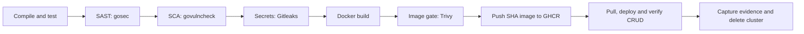

# Release Catalog — Session 17

Vimal Kumar Yadav · 24BCS10273

This Go API records service releases and their target environments. Its DevSecOps pipeline checks application behavior, source code, dependencies, Git history and the container image before publishing a SHA-tagged image to GitHub Container Registry and deploying it to a temporary Kubernetes cluster.

## Application

| Route | Behavior |
| --- | --- |
| `GET /`, `GET /healthz` | Application/build identity and health |
| `POST /api/releases` | Create a release with a random UUID |
| `GET /api/releases` | List releases |
| `GET /api/releases/{id}` | Read a release |
| `PUT /api/releases/{id}` | Replace its service, version and environment |
| `DELETE /api/releases/{id}` | Delete a release |

```bash
go test -race -v ./...
go run ./cmd/server
# In another terminal:
curl -s http://localhost:8080/api/releases -H 'Content-Type: application/json' \
  -d '{"service":"catalog","version":"1.0.0","environment":"staging"}'
```

Allowed environments are `development`, `staging` and `production`. Tests cover the complete CRUD lifecycle, validation, malformed/oversized JSON, missing records, health/version output and twenty concurrent creates. `github.com/google/uuid` is pinned in `go.mod`/`go.sum` and is included in dependency scanning.

The catalog intentionally uses in-memory storage and **one replica**. Records disappear on restart. It has no authentication and is intended for the isolated assignment environment; it is not a shared production catalog.

## Pipeline and gates



| Gate | Enforced policy |
| --- | --- |
| Application | Compilation, `go vet` and race-enabled tests must pass. |
| SAST | gosec rejects medium/high severity findings with medium/high confidence. |
| SCA | govulncheck checks the module graph and Go standard library for known vulnerabilities affecting the program. Text output retains its failure exit status. |
| Secret scanning | Gitleaks scans the checked-out Git history using its default rules; reports redact detected values. |
| Container image | Trivy rejects HIGH or CRITICAL vulnerabilities, including unfixed findings. No ignore file or `--ignore-unfixed` exemption is used. |
| Publication/deployment | Job dependencies and normal failure handling block downstream work if a prior gate fails. No scanner uses `continue-on-error`. |

The [workflow](.github/workflows/pipeline.yml) runs on code pushes and pull requests. Successful pushes to `main` or `assignment/**` publish `ghcr.io/vimalyad/devops-devsecops-demo:sha-<commit>` using GitHub's built-in token with `packages: write`. The deployment job authenticates with read access, retrieves that published image and loads it into kind. PR and `exercise/**` runs verify the container artifact without publishing a registry image.

Public repository visibility does not automatically make its GHCR package public. The workflow's scoped token can retrieve this repository's package. No personal token, AWS credential or permanent kubeconfig is stored in the repository or Actions secrets.

Actions are pinned to commit SHAs. Scanner binaries and Kubernetes tools are versioned in [tools.json](scripts/tools.json) and checked against release SHA256 digests. govulncheck is installed at a pinned module version. The Dockerfile uses a static, non-root executable in `scratch`; the runtime has no package manager or shell. Kubernetes adds a read-only filesystem, dropped capabilities, resource bounds and all three health probes.

## Local container and deployment

```bash
docker build --build-arg VERSION=local -t release-catalog:local .
docker run --rm --read-only --cap-drop ALL -p 127.0.0.1:8080:8080 release-catalog:local
```

For the complete temporary deployment on Linux x86_64 with Docker:

```bash
python3 scripts/install-tools.py kind kubectl
EXPECTED_VERSION=local bash scripts/deploy.sh release-catalog:local
```

The script uses an isolated kubeconfig, loads the image, waits for rollout, exercises CRUD through the Service, records Pod/image/version evidence and deletes its cluster on exit. It never connects to an existing cluster. `LOCAL_PORT` can override the default forwarding port 18080.

Test reports, security reports, the container image and deployment evidence are uploaded as Actions artifacts with fourteen-day retention. The cleanup trap saves diagnostics on failure and deletes the cluster; an `always()` step repeats deletion as a fallback.

## Execution evidence

[Execution evidence](evidence/README.md) includes successful publication/deployment, a blocked security exercise, the corrected run, retained reports and terminal-only screenshots. Scan results describe the database and code at run time; later database updates can correctly cause a new run to fail.

## Assignment submission map

| Required deliverable | Submitted implementation |
| --- | --- |
| Application and unit tests | [HTTP server](cmd/server/main.go), [API and tests](internal/api/) |
| Dockerfile | [Non-root multi-stage build](Dockerfile) |
| GitHub Actions and security gates | [Pipeline](.github/workflows/pipeline.yml), [pinned tools](scripts/tools.json), [secret-scanner configuration](.gitleaks.toml) |
| Registry publication | [Successful GHCR push](evidence/runs/success/image-reports/registry-push.txt) and [deployment-side pull](evidence/runs/success/deployment-evidence/registry-pull.txt) |
| Kubernetes deployment | [Manifests](k8s/), [deployment script](scripts/deploy.sh), [HTTP CRUD checks](scripts/smoke.py) |
| Successful execution and screenshots | [Run records and terminal captures](evidence/README.md) |

The assignment specifies scan categories rather than a required application language or registry.
This Go implementation uses gosec for SAST, govulncheck for SCA, Gitleaks for secret scanning,
Trivy for the image gate and GHCR for publication. The image that passes scanning is the image
published and deployed. Kubernetes runs temporarily inside GitHub Actions, with verified cleanup.

Reference example reviewed: [session 17 submission](https://github.com/aryen1101/Learn_DEVOPS/blob/bc73ce6b8663b92b8ac7310418fa5ac7f4c39afd/Class_Assignments/DevSecOps/Readme.md).
Application code, pipeline reports and screenshots in this repository are from this project's own runs.

The scope follows the [session 17 homework](https://docs.google.com/document/d/1cjXFYf2Thm8cBEN-0C48B-v02cj3jGLd47lcO18prHE/edit). Tool references: [gosec](https://github.com/securego/gosec), [govulncheck](https://pkg.go.dev/golang.org/x/vuln/cmd/govulncheck), [Gitleaks](https://github.com/gitleaks/gitleaks), [Trivy vulnerability scanning](https://trivy.dev/docs/latest/scanner/vulnerability/), and [GHCR publication with Actions](https://docs.github.com/en/packages/managing-github-packages-using-github-actions-workflows/publishing-and-installing-a-package-with-github-actions).
