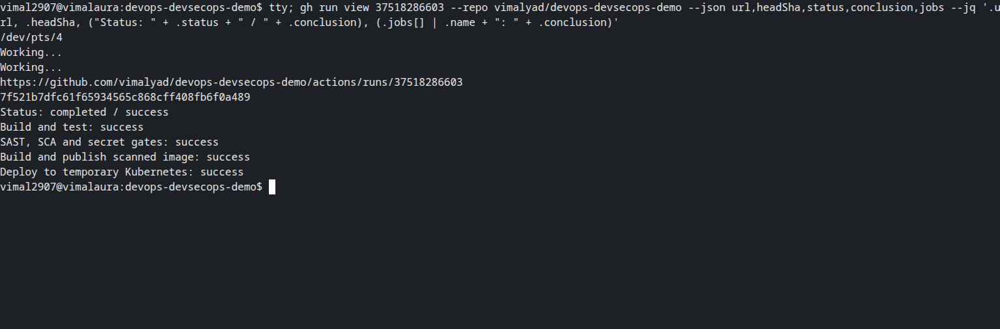
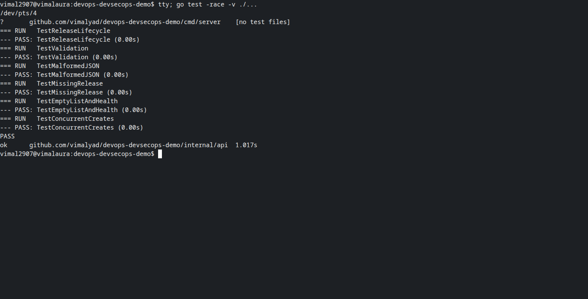
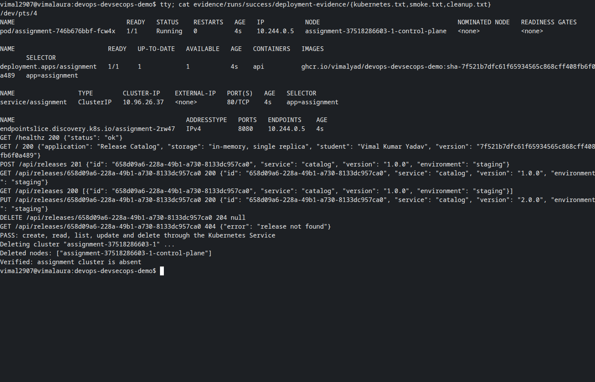
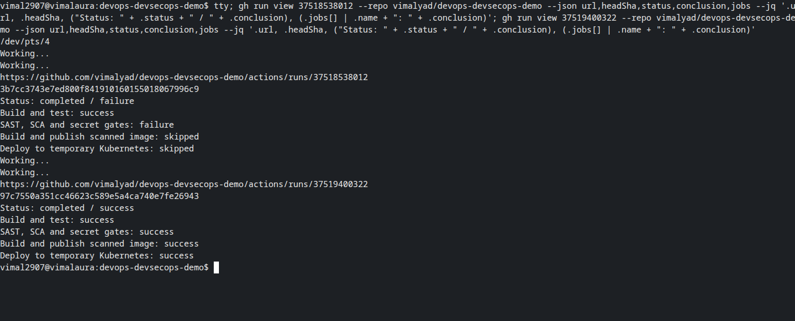
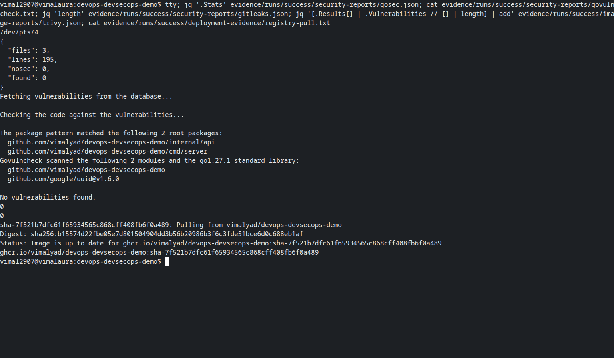
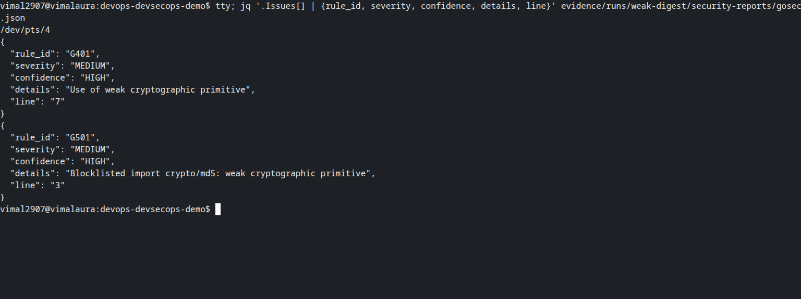

# Pipeline execution evidence

Vimal Kumar Yadav · 24BCS10273

These runs executed on GitHub-hosted runners on 6 October 2026 UTC (7 October in India). The commit IDs below identify the code tested; later documentation and screenshot commits do not change that recorded provenance.

| Exercise | GitHub run | Tested commit | Result | Preserved output |
| --- | --- | --- | --- | --- |
| Successful implementation | [37518286603](https://github.com/vimalyad/devops-devsecops-demo/actions/runs/37518286603) | `7f521b7dfc61` | success | [Metadata](runs/success/run.json), [full log](runs/success/actions.log) |
| Intentional failure | [37518538012](https://github.com/vimalyad/devops-devsecops-demo/actions/runs/37518538012) | `3b7cc3743e7e` | failure | [Metadata](runs/weak-digest/run.json), [full log](runs/weak-digest/actions.log) |
| Exercise corrected | [37519400322](https://github.com/vimalyad/devops-devsecops-demo/actions/runs/37519400322) | `97c7550a351c` | success | [Metadata](runs/recovered/run.json), [full log](runs/recovered/actions.log) |

The successful run passed tests, gosec, govulncheck, Gitleaks and the Trivy HIGH/CRITICAL image gate. It published and retrieved the SHA-tagged GHCR image, deployed one ready replica in kind and verified create, read, list, update and delete over HTTP. The returned version matched the tested commit. This single-replica, in-memory assignment API is not a persistent application.

The published image digest was `sha256:b15574d22fbe05e7d801504904dd3b56b20986b3f6c3fde51bce6d0c688eb1af`.

On `exercise/weak-digest`, a deliberately introduced `crypto/md5` example triggered gosec **G401** and **G501**, both MEDIUM severity with HIGH confidence. Tests passed, but the security job failed and image/deployment jobs were skipped. The finding was removed in a separate correction commit; all jobs then passed. Exercise branches use the image artifact without publishing another registry image. The weak code is absent from the PR branch and the current exercise branch.

The API package's statement coverage was 92.9%; this is not whole-program coverage. Scanner results describe the code, Go version and vulnerability databases at that run, not a permanent guarantee.

- [Unit test results](runs/success/test-results/tests.txt)
- [gosec: zero findings](runs/success/security-reports/gosec.json)
- [govulncheck: no affecting vulnerabilities](runs/success/security-reports/govulncheck.txt)
- [Gitleaks: no detected secrets](runs/success/security-reports/gitleaks.json)
- [Trivy image report](runs/success/image-reports/trivy.json)
- [Published registry digest](runs/success/image-reports/registry-digests.json) and [actual pull](runs/success/deployment-evidence/registry-pull.txt)
- [Blocked G401/G501 findings](runs/weak-digest/security-reports/gosec.json)
- [Ready workloads and Service](runs/success/deployment-evidence/kubernetes.txt)
- [HTTP checks and build version](runs/success/deployment-evidence/smoke.txt)
- [Cluster deletion](runs/success/deployment-evidence/cleanup.txt)
- [Deletion after the corrected exercise](runs/recovered/deployment-evidence/cleanup.txt)

Both successful runs deleted their temporary clusters and verified they were absent. The intentional failures never reached deployment. No AWS resources were used. Artifact text reports are preserved here because GitHub's uploaded artifacts have a fourteen-day retention period.

## Terminal screenshots

Every screenshot contains only a real spawned Bash pseudo-terminal, captured through Playwright/CDP. The visible `tty` command identifies the PTY. GitHub run queries and local tests execute directly; `cat` and `jq` inspect the unchanged downloaded reports. Saved reports are evidence of their original runs, not a claim that those deployments were rerun during capture.

